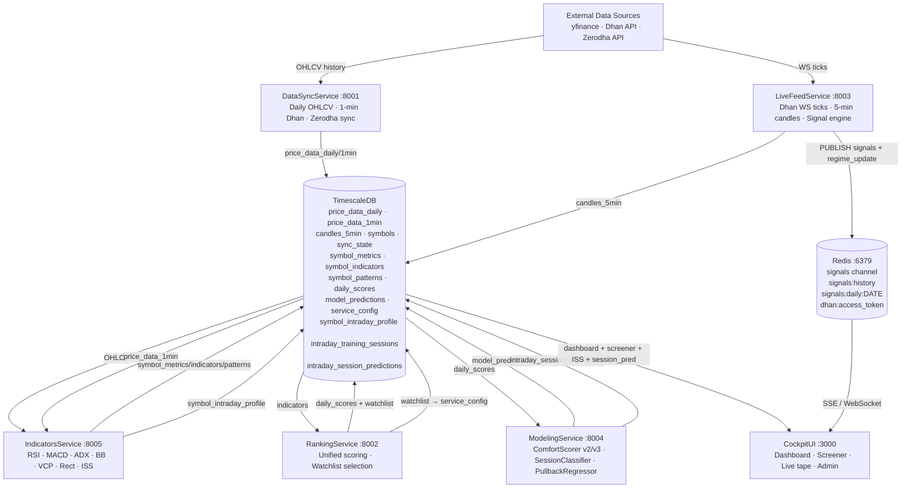
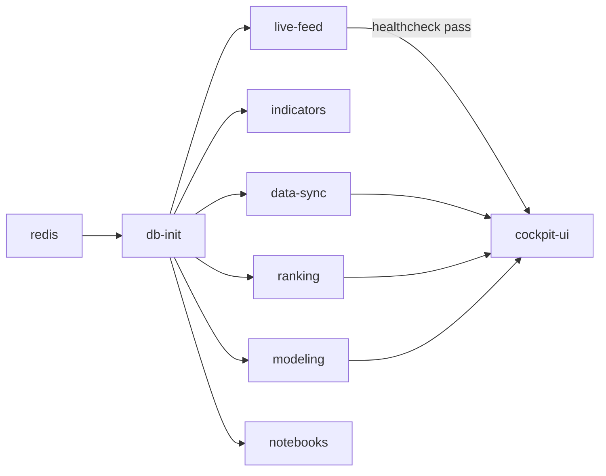
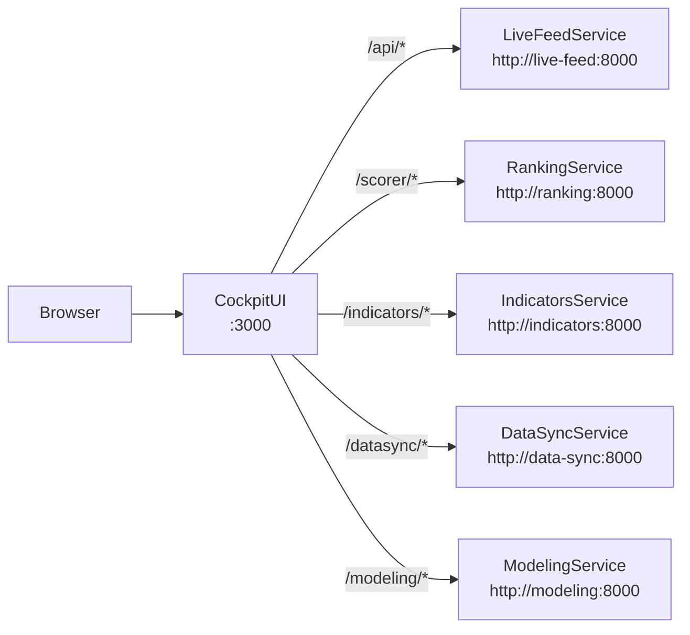

# System Architecture — trader-cockpit-app

## Overview

NSE trading platform: multi-service pipeline from raw market data to real-time signals. Five Python microservices + Next.js UI, all wired through TimescaleDB and Redis.



---

## Service Registry

| Service | Port | Runtime | Purpose |
|---|---|---|---|
| DataSyncService | 8001 | Python 3.12 + FastAPI | OHLCV ingestion, Zerodha integration |
| RankingService | 8002 | Python 3.12 + FastAPI | Composite scoring, watchlist selection |
| LiveFeedService | 8003 | Python 3.12 + FastAPI | Real-time ticks, signal detection, SSE |
| ModelingService | 8004 | Python 3.12 + FastAPI | ML model registry, comfort score predictions |
| IndicatorsService | 8005 | Python 3.12 + FastAPI | Technical indicator + pattern computation |
| CockpitUI | 3000 | Next.js 15 + React 19 | Dashboard, screener, signal tape |
| notebooks | 8888 | Jupyter + Python 3.12 | Research, backtesting |

---

## Shared Infrastructure

| Component | Technology | Connection |
|---|---|---|
| Database | TimescaleDB (PostgreSQL 16) | External — `POSTGRES_HOST:POSTGRES_PORT` |
| Cache / PubSub | Redis 7 | In-compose — `redis://redis:6379` |
| Network | Docker bridge `trader-bridge` | Services address each other by hostname |
| Package manager | `uv` | All Python services |
| Shared lib | `/shared` | asyncpg pool, migrations, base config — editable install |

---

## Docker Startup Dependency Order



---

## API Proxying (CockpitUI → Services)

All service calls from the browser go through Next.js reverse proxy. Defined in `CockpitUI/next.config.ts`:



> Internal port is 8000 (uvicorn inside container). External ports 8001–8005 map to host.

---

## Processing Cadence

| Job | Trigger | Service |
|---|---|---|
| Daily OHLCV sync | Manual (`POST /sync/run`) or `make sync` | DataSyncService |
| 1-min Dhan sync | Manual (`POST /sync/run-1min`) or `make sync-1min` | DataSyncService |
| Indicators compute | Manual (`POST /compute`) — after daily sync | IndicatorsService |
| **ISS compute** | Manual (`POST /compute-intraday-profile`) — after 1-min sync | IndicatorsService |
| Unified scoring | Manual (`POST /scores/compute`) — after indicators | RankingService |
| Comfort score (v2) | Manual (`POST /models/comfort_scorer/score-all`) | ModelingService |
| **Session predictions** | Manual (`POST /models/session_classifier/score-all`) — after scoring | ModelingService |
| **Comfort score v3** | Auto-triggered after session predictions (same call) | ModelingService |
| Real-time ticks | Continuous on startup | LiveFeedService |
| **Regime detection** | Continuous — every 5-min candle per symbol | LiveFeedService |
| Watchlist update | After scoring run — stored in `service_config` | RankingService → LiveFeedService |

Full daily pipeline: `make sync` → `make scores-compute` → `make comfort-score` → `POST /models/session_classifier/score-all`

**One-time operations (first run or weekly):**
- `POST /models/session_classifier/build-training-data` — rebuild 5yr labeled sessions
- `POST /models/session_classifier/train` — retrain LightGBM models
- `POST /compute-intraday-profile` — ISS runs nightly after 1-min sync

---

## Environment Variables (Critical)

```bash
# Database
DB_USER / DB_PASSWORD / DB_NAME
POSTGRES_HOST / POSTGRES_PORT
DATABASE_URL=postgresql://$DB_USER:$DB_PASSWORD@$POSTGRES_HOST:$POSTGRES_PORT/$DB_NAME

# Cache
REDIS_URL=redis://redis:6379

# Dhan API
DHAN_CLIENT_ID
DHAN_ACCESS_TOKEN

# Volumes
DOCKER_DATA_PATH=d:/docker-data

# Service tuning (examples)
SYNC_BATCH_SIZE=50
INDICATORS_CONCURRENCY=10
AUTO_RETRAIN_ENABLED=true
MAX_MODEL_AGE_DAYS=90
```
