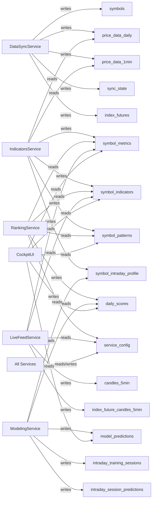

# Database Reference

**Engine:** TimescaleDB (PostgreSQL 16)  
**Schema source:** `infra/db/init.sql`  
**Bootstrap:** `infra/db/setup.sh`

---

## Table Ownership Map



---

## Entity Relationships

```mermaid
erDiagram
    symbols {
        varchar symbol PK
        text company_name
        varchar series
        varchar isin
        date listed_date
        numeric face_value
        bigint dhan_security_id
        varchar exchange_segment
        boolean is_fno
        timestamptz created_at
    }

    price_data_daily {
        timestamptz time PK
        varchar symbol PK
        numeric open
        numeric high
        numeric low
        numeric close
        bigint volume
    }

    price_data_1min {
        timestamptz time PK
        varchar symbol PK
        numeric open
        numeric high
        numeric low
        numeric close
        bigint volume
    }

    sync_state {
        varchar symbol PK
        varchar timeframe PK
        timestamptz last_synced_at
        timestamptz last_data_ts
        varchar status
        text error_msg
    }

    symbol_metrics {
        varchar symbol PK
        timestamptz computed_at
        numeric week52_high
        numeric week52_low
        numeric atr_14
        numeric adv_20_cr
        numeric ema_20
        numeric ema_50
        numeric ema_200
        numeric prev_day_close
        numeric cam_median_range_pct
    }

    symbol_indicators {
        varchar symbol PK
        timestamptz computed_at
        numeric rsi_14
        numeric macd_hist
        numeric adx_14
        varchar weekly_bias
        boolean bb_squeeze
        smallint squeeze_days
        boolean nr7
        numeric rs_vs_nifty
        varchar stage
    }

    symbol_patterns {
        varchar symbol PK
        timestamptz computed_at
        boolean vcp_detected
        smallint vcp_contractions
        boolean rect_breakout
        numeric rect_range_pct
        smallint consolidation_days
    }

    daily_scores {
        varchar symbol PK
        date score_date PK
        numeric total_score
        numeric momentum_score
        numeric trend_score
        numeric volatility_score
        numeric structure_score
        integer rank
        boolean is_watchlist
        varchar stage
    }

    model_predictions {
        bigserial id PK
        text model_name
        text model_version
        text symbol
        date prediction_date
        jsonb predictions
        real confidence
    }

    candles_5min {
        timestamptz time PK
        varchar symbol PK
        numeric open
        numeric high
        numeric low
        numeric close
        bigint volume
        integer tick_count
    }

    service_config {
        varchar service PK
        varchar key PK
        jsonb value
        timestamptz updated_at
    }

    symbols ||--o{ price_data_daily : "has"
    symbols ||--o{ price_data_1min : "has"
    symbols ||--|| symbol_metrics : "has"
    symbols ||--|| symbol_indicators : "has"
    symbols ||--|| symbol_patterns : "has"
    symbols ||--o{ daily_scores : "scored"
    symbols ||--o{ model_predictions : "predicted"
    symbols ||--o{ candles_5min : "intraday"
    symbols ||--o{ sync_state : "tracked"
    symbols ||--|| symbol_intraday_profile : "has"
    symbols ||--o{ intraday_training_sessions : "trained"
    symbols ||--o{ intraday_session_predictions : "predicted"
```



---

## Hypertables (Time-Series)

### `price_data_daily`
Owner: DataSyncService | Chunk interval: 1 month | Compression: 30-day policy

```sql
time            TIMESTAMPTZ  NOT NULL
symbol          VARCHAR(30)  NOT NULL
open            NUMERIC(14,4)
high            NUMERIC(14,4)
low             NUMERIC(14,4)
close           NUMERIC(14,4)
volume          BIGINT

PRIMARY KEY (symbol, time)
Partition: by symbol, 8 partitions
```

### `price_data_1min`
Owner: DataSyncService | Chunk interval: 1 week | Compression: 7-day policy

```sql
time            TIMESTAMPTZ  NOT NULL
symbol          VARCHAR(30)  NOT NULL
open            NUMERIC(10,4)
high            NUMERIC(10,4)
low             NUMERIC(10,4)
close           NUMERIC(10,4)
volume          BIGINT

PRIMARY KEY (symbol, time)
Partition: by symbol, 4 partitions
```

### `candles_5min`
Owner: LiveFeedService | Chunk interval: 1 day

```sql
time            TIMESTAMPTZ  NOT NULL
symbol          VARCHAR(30)  NOT NULL
open            NUMERIC(14,4)
high            NUMERIC(14,4)
low             NUMERIC(14,4)
close           NUMERIC(14,4)
volume          BIGINT       DEFAULT 0
tick_count      INTEGER      DEFAULT 0

PRIMARY KEY (symbol, time)
Partition: by symbol, 16 partitions
```

### `index_future_candles_5min`
Owner: LiveFeedService | Chunk interval: 1 day

```sql
time            TIMESTAMPTZ  NOT NULL
symbol          VARCHAR(20)  NOT NULL
open            NUMERIC(14,4)
high            NUMERIC(14,4)
low             NUMERIC(14,4)
close           NUMERIC(14,4)
volume          BIGINT       DEFAULT 0
tick_count      INTEGER      DEFAULT 0

PRIMARY KEY (symbol, time)
```

---

## Reference Tables

### `symbols`
Owner: DataSyncService

```sql
symbol              VARCHAR(30)   PRIMARY KEY
company_name        TEXT
series              VARCHAR(10)   DEFAULT 'EQ'
isin                VARCHAR(20)
listed_date         DATE
face_value          NUMERIC(10,2)
dhan_security_id    BIGINT
exchange_segment    VARCHAR(20)
is_fno              BOOLEAN       DEFAULT FALSE
created_at          TIMESTAMPTZ
```

### `sync_state`
Owner: DataSyncService

```sql
symbol          VARCHAR(30)   NOT NULL
timeframe       VARCHAR(10)   NOT NULL    -- '1d', '1m'
last_synced_at  TIMESTAMPTZ
last_data_ts    TIMESTAMPTZ
status          VARCHAR(20)               -- 'pending', 'success', 'error'
error_msg       TEXT

PRIMARY KEY (symbol, timeframe)
```

### `index_futures`
Owner: DataSyncService

```sql
id                  SERIAL        PRIMARY KEY
underlying          VARCHAR(20)   NOT NULL
dhan_security_id    BIGINT
exchange_segment    VARCHAR(20)
lot_size            INTEGER       DEFAULT 1
expiry_date         DATE
is_active           BOOLEAN       DEFAULT FALSE
created_at          TIMESTAMPTZ

UNIQUE (underlying, expiry_date)
```

---

## Computed / Analytics Tables

### `symbol_metrics`
Owner: IndicatorsService | Updated: daily

```sql
symbol              VARCHAR(30)   PRIMARY KEY
computed_at         TIMESTAMPTZ
week52_high         NUMERIC(14,4)
week52_low          NUMERIC(14,4)
atr_14              NUMERIC(14,4)
adv_20_cr           NUMERIC(10,2)   -- avg daily value in crore
trading_days        INTEGER
prev_day_high       NUMERIC(14,4)
prev_day_low        NUMERIC(14,4)
prev_day_close      NUMERIC(14,4)
prev_week_high      NUMERIC(14,4)
prev_week_low       NUMERIC(14,4)
prev_month_high     NUMERIC(14,4)
prev_month_low      NUMERIC(14,4)
ema_20              NUMERIC(14,4)
ema_50              NUMERIC(14,4)
ema_200             NUMERIC(14,4)
week_return_pct     NUMERIC(9,4)
week_gain_pct       NUMERIC(9,4)
week_decline_pct    NUMERIC(9,4)
cam_median_range_pct NUMERIC(10,6)
```

### `symbol_indicators`
Owner: IndicatorsService | Updated: daily

```sql
symbol          VARCHAR(30)   PRIMARY KEY  -- FK → symbols
computed_at     TIMESTAMPTZ
rsi_14          NUMERIC(6,2)
macd_hist       NUMERIC(12,6)
macd_hist_std   NUMERIC(12,6)
roc_5           NUMERIC(9,4)
roc_20          NUMERIC(9,4)
roc_60          NUMERIC(9,4)
vol_ratio_20    NUMERIC(8,4)
adx_14          NUMERIC(6,2)
plus_di         NUMERIC(6,2)
minus_di        NUMERIC(6,2)
weekly_bias     VARCHAR(10)    DEFAULT 'NEUTRAL'
bb_squeeze      BOOLEAN        DEFAULT FALSE
squeeze_days    SMALLINT       DEFAULT 0
nr7             BOOLEAN        DEFAULT FALSE
atr_ratio       NUMERIC(8,4)
atr_5           NUMERIC(14,4)
bb_width        NUMERIC(10,6)
kc_width        NUMERIC(10,6)
rs_vs_nifty     NUMERIC(9,4)
stage           VARCHAR(20)    DEFAULT 'UNKNOWN'
```

### `symbol_patterns`
Owner: IndicatorsService | Updated: daily

```sql
symbol              VARCHAR(30)   PRIMARY KEY  -- FK → symbols
computed_at         TIMESTAMPTZ
vcp_detected        BOOLEAN        DEFAULT FALSE
vcp_contractions    SMALLINT       DEFAULT 0
rect_breakout       BOOLEAN        DEFAULT FALSE
rect_range_pct      NUMERIC(6,2)
consolidation_days  SMALLINT       DEFAULT 0
```

### `daily_scores`
Owner: RankingService | Updated: daily

```sql
symbol              VARCHAR(30)   NOT NULL
score_date          DATE          NOT NULL
total_score         NUMERIC(6,2)
momentum_score      NUMERIC(6,2)
trend_score         NUMERIC(6,2)
volatility_score    NUMERIC(6,2)
structure_score     NUMERIC(6,2)
rank                INTEGER
is_watchlist        BOOLEAN        DEFAULT FALSE
computed_at         TIMESTAMPTZ

-- Embedded indicator snapshot (no look-ahead, for ML features):
rsi_14  macd_hist  macd_hist_std
roc_5  roc_20  roc_60
vol_ratio_20
adx_14  plus_di  minus_di
weekly_bias  bb_squeeze  squeeze_days
nr7  atr_ratio  atr_5  bb_width  kc_width
rs_vs_nifty  stage

PRIMARY KEY (symbol, score_date)
```

### `model_predictions`
Owner: ModelingService | Updated: daily

```sql
id                  BIGSERIAL     PRIMARY KEY
model_name          TEXT          NOT NULL
model_version       TEXT          NOT NULL
symbol              TEXT          NOT NULL
prediction_date     DATE          NOT NULL
predictions         JSONB         NOT NULL
confidence          REAL
created_at          TIMESTAMPTZ

UNIQUE (model_name, symbol, prediction_date)
```

---

## Intraday ML Tables

### `symbol_intraday_profile`
Owner: IndicatorsService | Updated: nightly after 1-min sync | Source: `price_data_1min` (90-day rolling)

```sql
symbol                          VARCHAR(30)   PRIMARY KEY
computed_at                     TIMESTAMPTZ   NOT NULL
sessions_analyzed               INTEGER       -- number of sessions used
choppiness_idx                  NUMERIC(8,4)  -- avg Choppiness Index (38=trending, 61.8=chop)
stop_hunt_rate                  NUMERIC(6,4)  -- fraction sessions both sides tagged ≥0.4%
orb_followthrough_rate          NUMERIC(6,4)  -- fraction ORB extended ≥0.5R within 60 bars
opening_drive_rate              NUMERIC(6,4)  -- fraction first-30min direction = EOD direction
pullback_depth_on_up_days       NUMERIC(6,4)  -- avg (intraday_high−close)/(intraday_high−open)
volatility_compression_ratio    NUMERIC(8,4)  -- avg 1min session range / daily ATR
trend_autocorr                  NUMERIC(8,4)  -- avg lag-1 autocorr of 1min returns
iss_score                       NUMERIC(6,2)  -- composite ISS 0-100
```

**ISS Composite:**
```
iss = 0.25 × chop_score           (low choppiness = better)
    + 0.20 × (1 − stop_hunt_rate)  (less stop hunting = better)
    + 0.20 × orb_followthrough     (breakout follow = better)
    + 0.15 × opening_drive_rate    (drive alignment = better)
    + 0.15 × (1 − pullback_depth)  (shallow pullbacks = better)
    + 0.05 × vol_comp_score        (1.0 ratio = ideal)
```

---

### `intraday_training_sessions`
Owner: ModelingService | Built once + refreshed weekly | Source: `price_data_daily` (5yr) + `symbol_intraday_profile`

```sql
symbol              VARCHAR(30)   NOT NULL
session_date        DATE          NOT NULL

-- Features (from prev day's daily_scores)
prev_rsi            NUMERIC(8,4)
prev_adx            NUMERIC(8,4)
prev_di_spread      NUMERIC(8,4)   -- plus_di − minus_di
prev_atr_ratio      NUMERIC(8,4)
prev_roc_5          NUMERIC(8,4)
prev_roc_20         NUMERIC(8,4)
prev_vol_ratio      NUMERIC(8,4)
prev_bb_squeeze     BOOLEAN
prev_squeeze_days   INTEGER
prev_rs_vs_nifty    NUMERIC(8,4)
stage_encoded       SMALLINT       -- 0=UNKNOWN,1=STAGE_1..4=STAGE_4
day_of_week         SMALLINT       -- 0=Mon,4=Fri
nifty_gap_pct       NUMERIC(8,4)

-- ISS features (NULL for sessions older than 90d 1-min window)
iss_score               NUMERIC(6,2)
choppiness_idx          NUMERIC(8,4)
stop_hunt_rate          NUMERIC(6,4)
orb_followthrough_rate  NUMERIC(6,4)
pullback_depth_hist     NUMERIC(6,4)

-- Labels (derived from that session's daily OHLCV)
high_close_ratio    NUMERIC(6,4)   -- (close−low)/(high−low)
range_vs_atr        NUMERIC(6,4)   -- (high−low)/atr_14
pullback_depth      NUMERIC(6,4)   -- (high−close)/(high−low) on up days, NULL otherwise
session_type        VARCHAR(15)    -- TREND_UP|TREND_DOWN|CHOP|VOLATILE|GAP_FADE|NEUTRAL
trend_up            BOOLEAN
trend_down          BOOLEAN
chop_day            BOOLEAN
volatile_day        BOOLEAN

computed_at         TIMESTAMPTZ
PRIMARY KEY (symbol, session_date)
```

**Session type label rules:**

| Label | Condition |
|---|---|
| `TREND_UP` | `high_close_ratio > 0.65` AND `range_vs_atr > 0.8` AND close > open |
| `TREND_DOWN` | `low_close_ratio > 0.65` AND `range_vs_atr > 0.8` AND close < open |
| `VOLATILE` | `range_vs_atr > 1.6` |
| `GAP_FADE` | gap > 0.5% AND price closed against gap direction |
| `CHOP` | `range_vs_atr < 0.7` OR mid-range close |
| `NEUTRAL` | everything else |

---

### `intraday_session_predictions`
Owner: ModelingService | Updated: nightly after scoring | Source: trained LightGBM models

```sql
symbol                  VARCHAR(30)   NOT NULL
prediction_date         DATE          NOT NULL
session_type_pred       VARCHAR(15)   -- predicted session type for tomorrow
trend_up_prob           NUMERIC(6,4)  -- probability 0-1
trend_down_prob         NUMERIC(6,4)
chop_prob               NUMERIC(6,4)
volatile_prob           NUMERIC(6,4)
pullback_depth_pred     NUMERIC(6,4)  -- predicted pullback depth 0-1 (NULL if down day expected)
model_version           VARCHAR(20)   DEFAULT 'session_v1'
computed_at             TIMESTAMPTZ

PRIMARY KEY (symbol, prediction_date)
```

---

## Shared / Config Tables

### `service_config`
Owner: All services (read/write via shared `config_store.py`)

```sql
service     VARCHAR(50)   NOT NULL   -- 'datasync', 'ranking', 'livefeed', etc.
key         VARCHAR(100)  NOT NULL
value       JSONB         NOT NULL
updated_at  TIMESTAMPTZ

PRIMARY KEY (service, key)
```

Special use: RankingService writes watchlist symbol list here post-scoring.  
LiveFeedService reads it to determine Dhan WebSocket subscriptions.

---

## Data Freshness Contract

| Table | Written By | Read By |
|---|---|---|
| `symbols` | DataSyncService | All services |
| `price_data_daily` | DataSyncService | IndicatorsService |
| `price_data_1min` | DataSyncService | IndicatorsService |
| `sync_state` | DataSyncService | DataSyncService |
| `index_futures` | DataSyncService | LiveFeedService |
| `symbol_metrics` | IndicatorsService | RankingService, LiveFeedService, CockpitUI |
| `symbol_indicators` | IndicatorsService | RankingService, LiveFeedService, CockpitUI |
| `symbol_patterns` | IndicatorsService | RankingService, CockpitUI |
| `daily_scores` | RankingService | ModelingService, CockpitUI |
| `candles_5min` | LiveFeedService | LiveFeedService (warm-start) |
| `index_future_candles_5min` | LiveFeedService | LiveFeedService (bias tracking) |
| `model_predictions` | ModelingService | CockpitUI (via RankingService dashboard) |
| `symbol_intraday_profile` | IndicatorsService | ModelingService, RankingService, CockpitUI |
| `intraday_training_sessions` | ModelingService | ModelingService (training only) |
| `intraday_session_predictions` | ModelingService | RankingService, LiveFeedService, CockpitUI |
| `service_config` | All services | All services |

---

## TimescaleDB Partitioning Notes

- `price_data_daily` and `price_data_1min` use **space partitioning by symbol** before time-partitioning. Queries filtering by symbol skip irrelevant partitions.
- `candles_5min` uses 16 space partitions — higher cardinality for intraday write throughput.
- All hypertables have compression policies — compressed chunk queries go through decompression.
- `daily_scores` is a regular table (not a hypertable) — always include `score_date` filter for query performance.

---

## Connection Management (via shared lib)

```python
# Pool creation (each service at startup):
pool = await create_pool(
    dsn=settings.database_url,
    min_size=5,
    max_size=20,
    command_timeout=60
)

# Server-level settings applied at connect:
# SET lock_timeout = '5s'
# SET idle_in_transaction_session_timeout = '30s'
# tcp_keepalives enabled (prevents stale connections through Docker NAT)
```
