# Data Pipeline — End to End

## Full Pipeline Overview

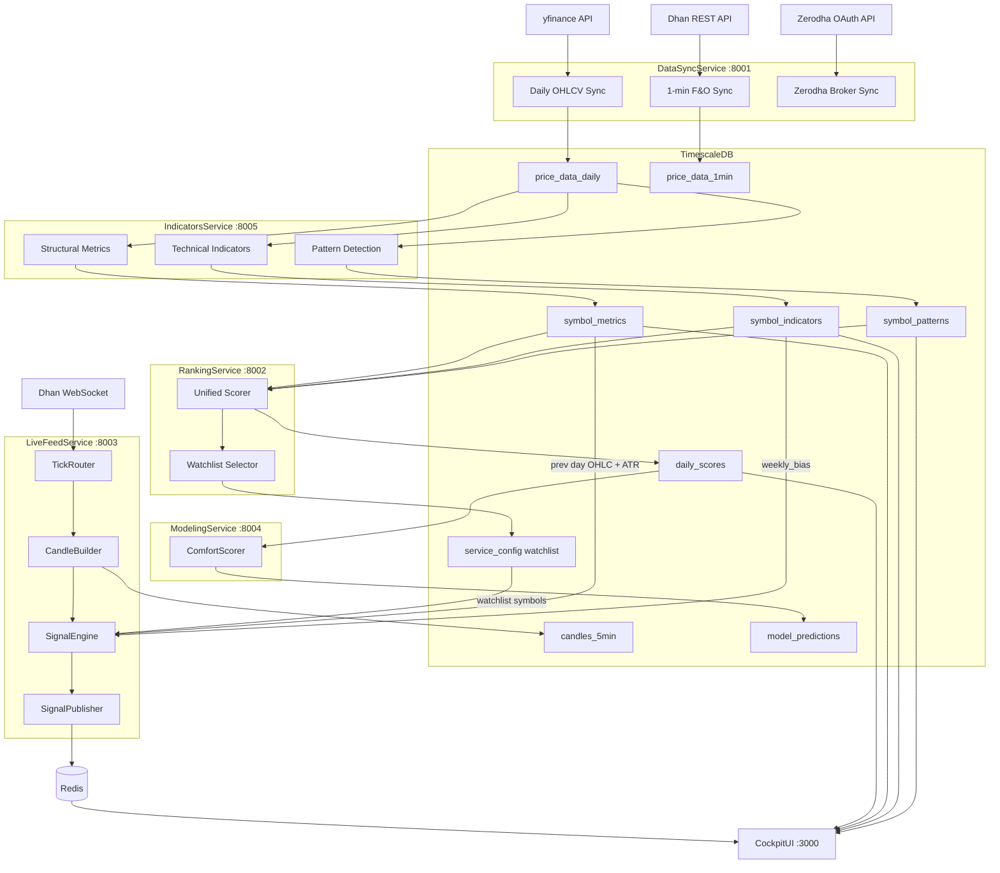

---

## Stage 1: Ingestion (DataSyncService)

### Daily OHLCV — yfinance

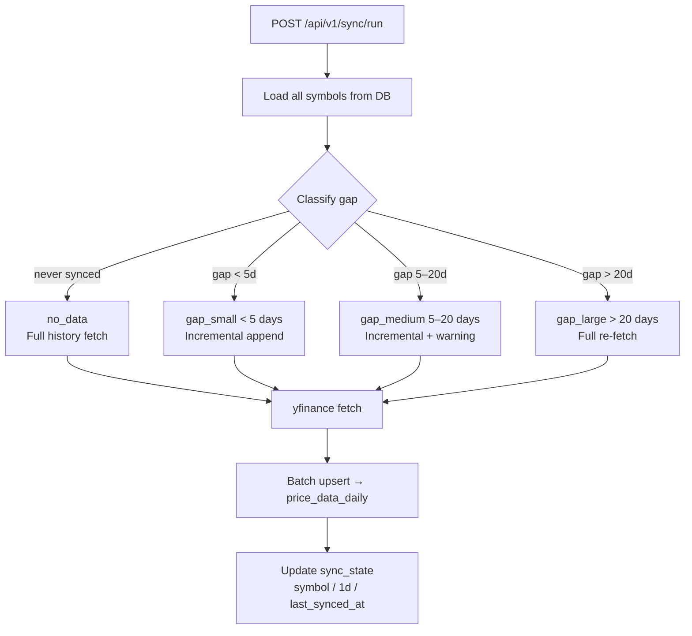

**Gap classification thresholds:**

| Class | Condition | Action |
|---|---|---|
| `no_data` | Never synced | Full history fetch |
| `gap_small` | < 5 trading days | Incremental append |
| `gap_medium` | 5–20 days | Incremental with warning |
| `gap_large` | > 20 days | Full re-fetch from last good date |

### 1-Minute OHLCV — Dhan API

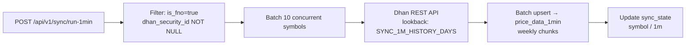

### Zerodha Broker Sync

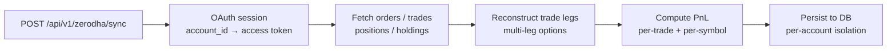

---

## Stage 2: Indicator Computation (IndicatorsService)

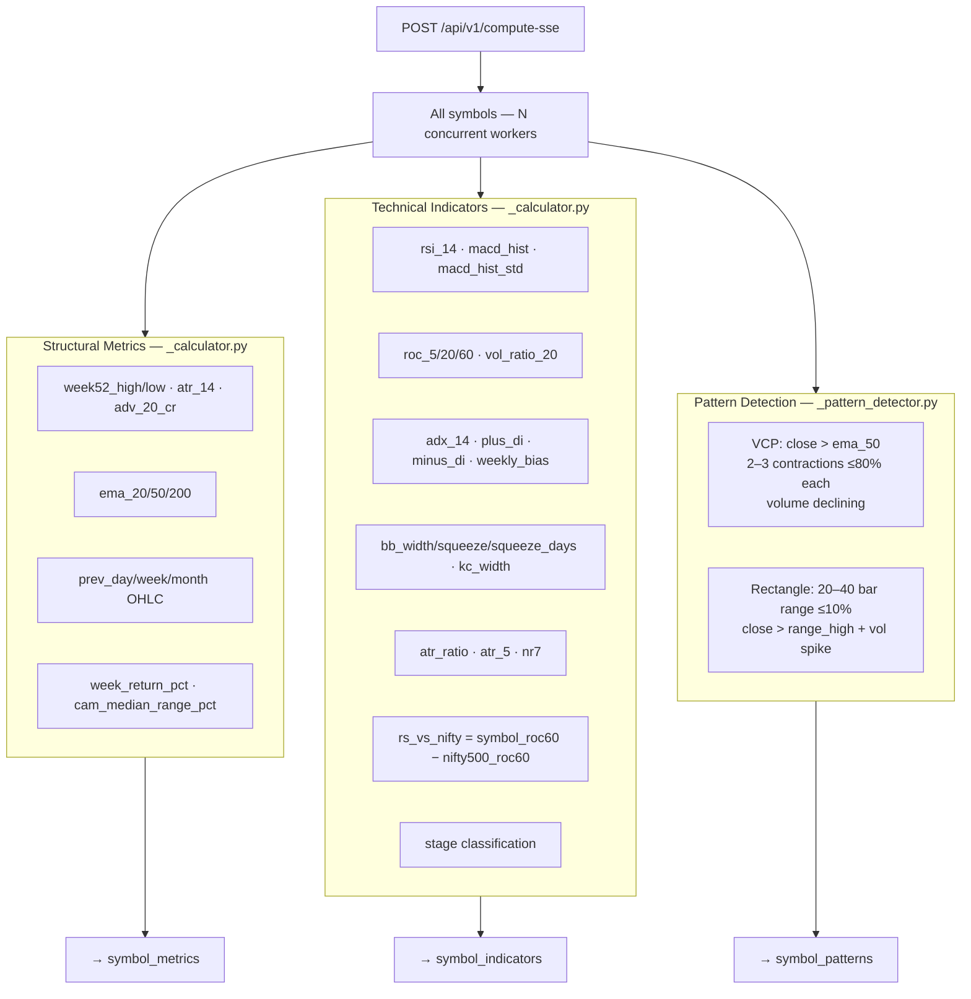

---

## Stage 3: Scoring (RankingService)

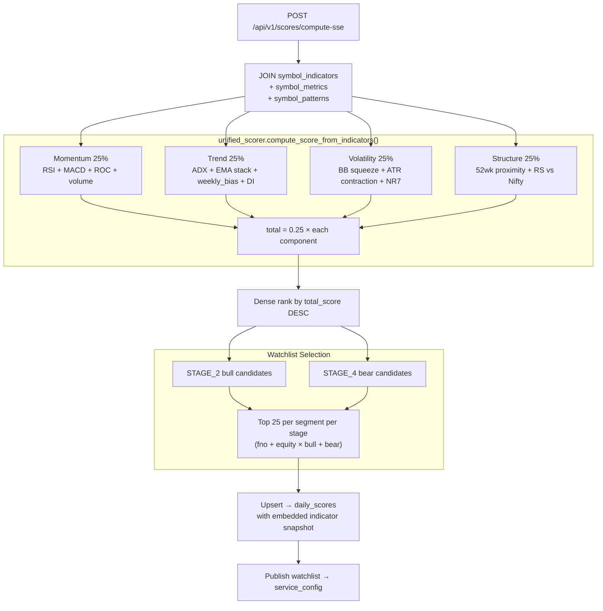

### Stage Classification

| Stage | Condition |
|---|---|
| `STAGE_1` | Below EMA-200, EMA-50 flat or declining |
| `STAGE_2` | Above EMA-200, EMA-50 rising, positive momentum |
| `STAGE_3` | Topping — below EMA-50, above EMA-200 but weakening |
| `STAGE_4` | Below EMA-200 and EMA-50, negative momentum |
| `UNKNOWN` | Insufficient data |

### Scoring Component Weights

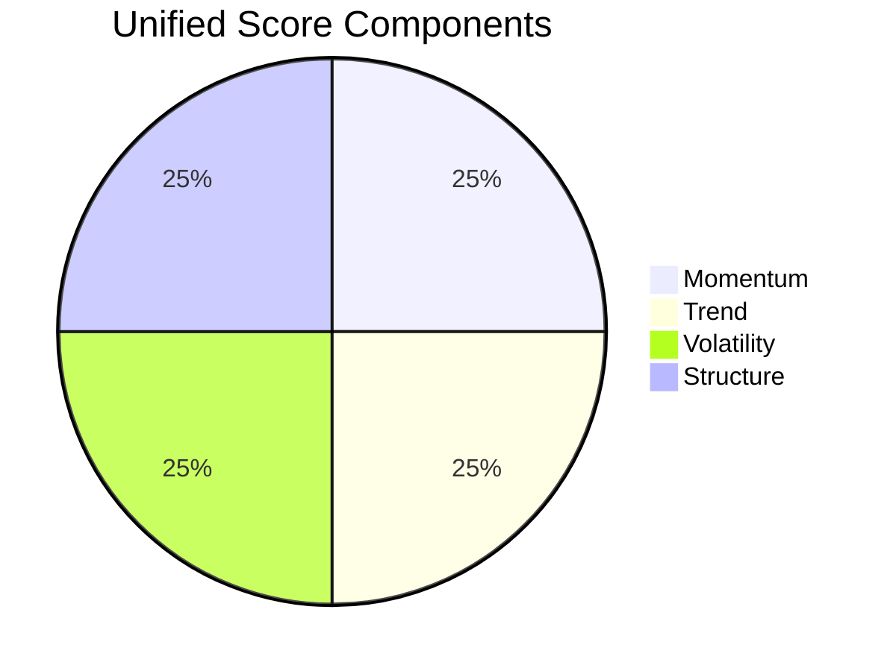

---

## Stage 4: ML Predictions (ModelingService)

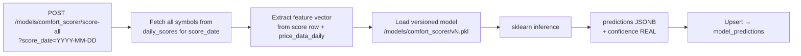

---

## Stage 5: Real-Time Feed (LiveFeedService)

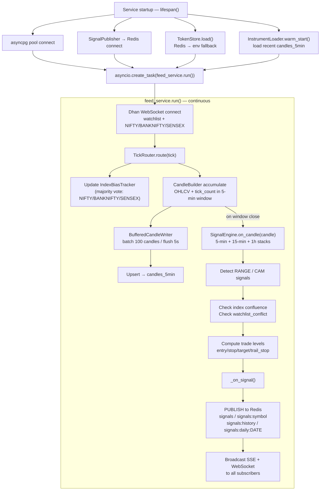

---

## Stage 6: UI Consumption (CockpitUI)

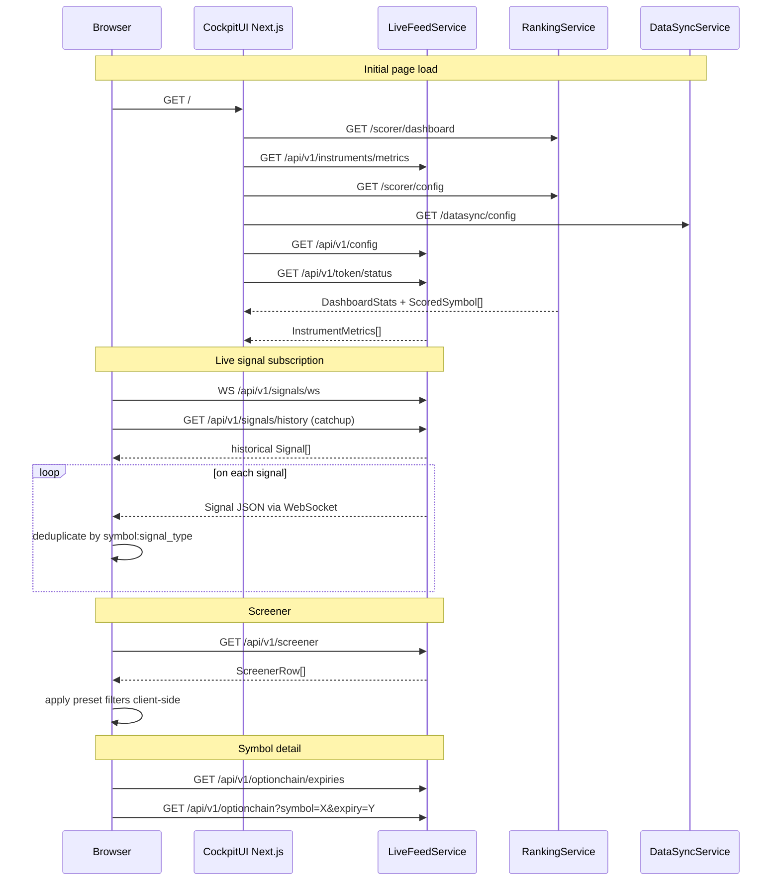

---

## Full Daily Pipeline (Ordered)

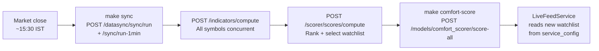

---

## Data Freshness Contract

| Table | Written by | Frequency |
|---|---|---|
| `price_data_daily` | DataSyncService | Daily post-market |
| `price_data_1min` | DataSyncService | Daily (F&O symbols) |
| `candles_5min` | LiveFeedService | Continuous (trading hours) |
| `symbol_metrics` | IndicatorsService | Daily (after sync) |
| `symbol_indicators` | IndicatorsService | Daily (after sync) |
| `symbol_patterns` | IndicatorsService | Daily (after sync) |
| `daily_scores` | RankingService | Daily (after indicators) |
| `model_predictions` | ModelingService | Daily (after scoring) |
| `service_config` (watchlist) | RankingService | After each scoring run |
