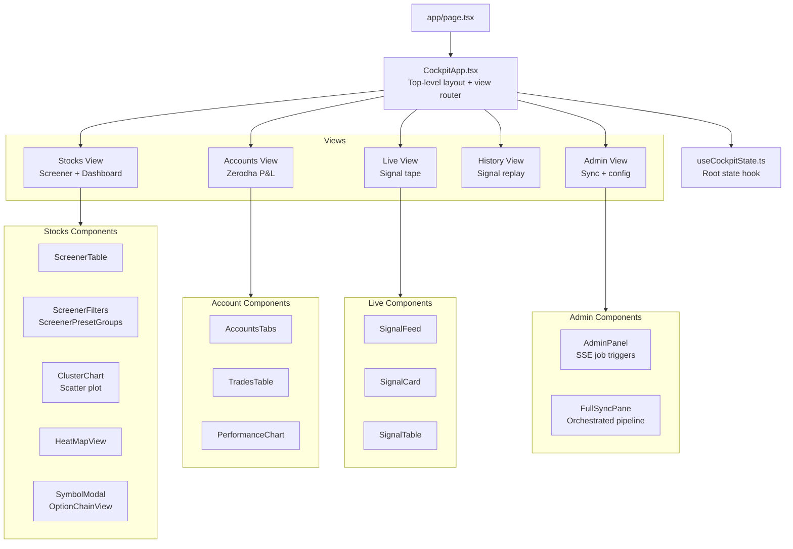
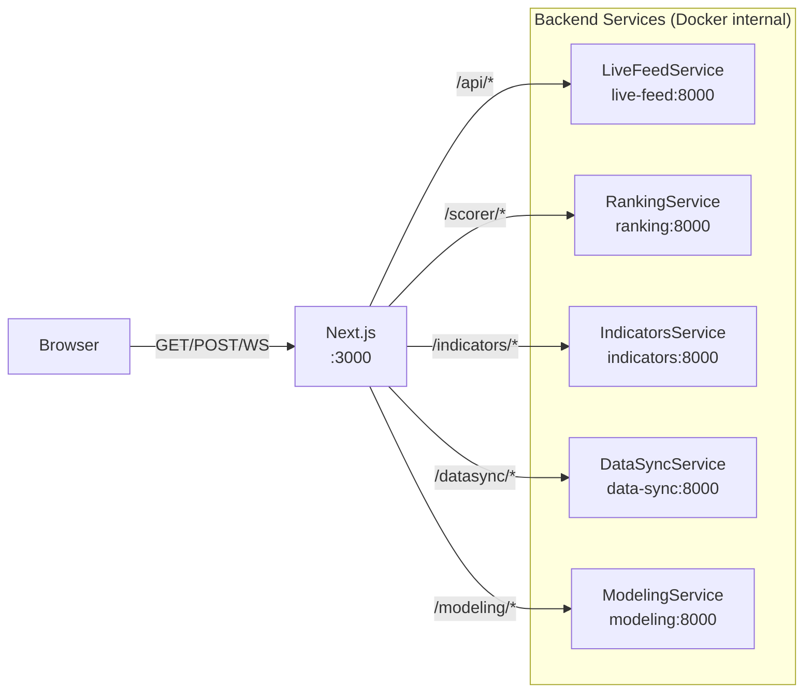
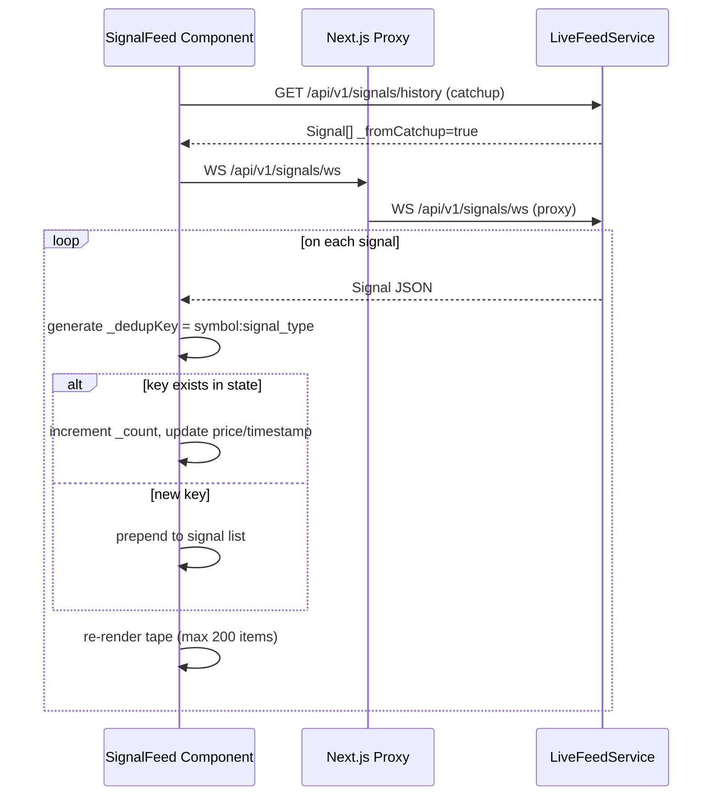
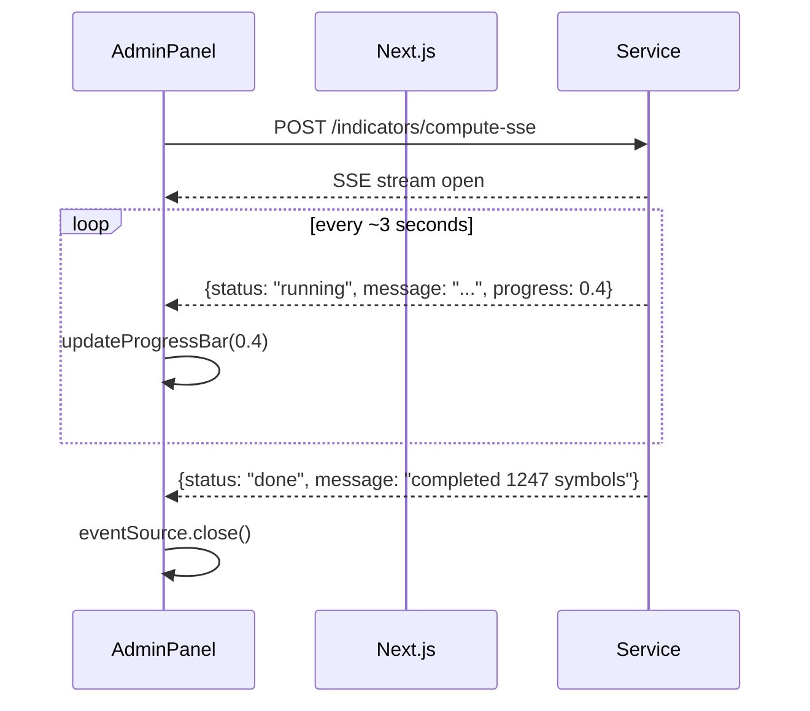
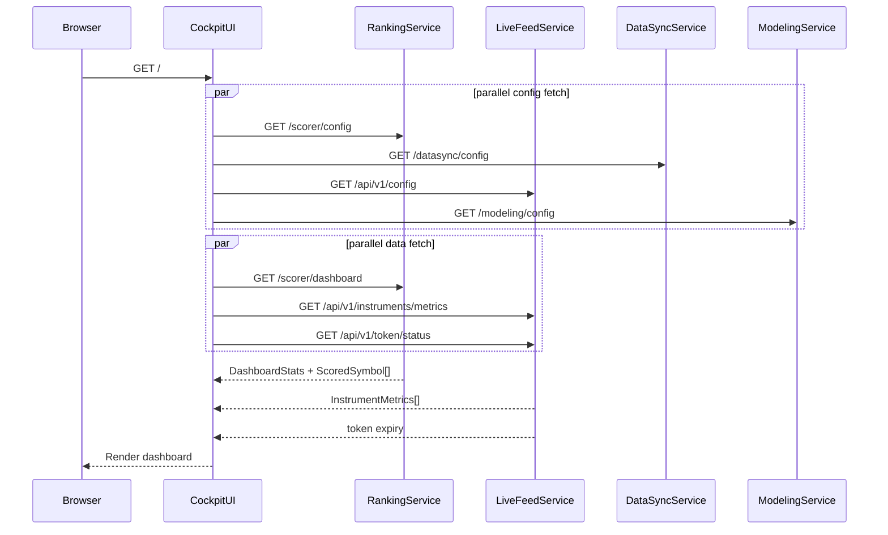

# CockpitUI — Frontend Reference

**Framework:** Next.js 15 (App Router)  
**Language:** TypeScript + React 19  
**Styling:** Tailwind CSS  
**Location:** `CockpitUI/src/`

---

## Component Tree



---

## API Proxy Routing



---

## App State (`useCockpitState.ts`)

```typescript
type AppView = 'stocks' | 'accounts' | 'live' | 'history' | 'admin'
type ThemeMode = 'dark' | 'light'

type InitialConfigs = {
  scorer:   Record<string, unknown> | null
  datasync: Record<string, unknown> | null
  livefeed: Record<string, unknown> | null
  modeling: Record<string, unknown> | null
}
```

State loaded on mount:
1. Fetch all four service configs in parallel
2. Fetch dashboard data (scores + stats)
3. Fetch instrument metrics (screener universe)
4. Fetch Dhan token status

---

## Views

### Stocks View (`components/screener/`)
- Loads `InstrumentMetrics[]` from `/api/v1/instruments/metrics`
- Loads `ScreenerRow[]` from `/api/v1/screener`
- Client-side filter application via `ScreenerPresetGroups`
- All sorting, pagination, column selection in-browser
- Symbol click → `SymbolModal`

### Accounts View (`components/accounts/`)
- Tabs: Performance | Trades | Positions | Holdings
- `GET /datasync/zerodha/dashboard` → summary stats
- `GET /datasync/zerodha/trades` → reconstructed trade list
- `GET /datasync/zerodha/performance` → PnL curve

### Live View (`components/signals/SignalFeed`)
- WebSocket: `WS /api/v1/signals/ws`
- On connect: fetch history from `/api/v1/signals/history` (catchup)
- Deduplication: by `(symbol, signal_type)` — replaces older entry, increments `_count`
- Two display modes: Card view | Table view
- `watchlist_conflict=true` signals shown with visual warning indicator

### History View
- `GET /api/v1/signals/history/dates` → available date list
- `GET /api/v1/signals/history?date=YYYY-MM-DD` → Signal[] for that date
- Same SignalFeed component in read-only replay mode

### Admin View (`components/admin/`)
- **AdminPanel**: individual job triggers with SSE progress bars
- **FullSyncPane**: orchestrated pipeline (datasync → indicators → scoring → modeling)
- Config editors for each service (reads from `/*/config`, saves via PUT/POST)

---

## WebSocket Signal Flow



---

## SSE Progress Pattern (Admin)



---

## Initial Page Load Sequence



---

## API Endpoint Constants (`lib/api-config.ts`)

```typescript
const LIVE_FEED = {
  STATUS:                '/api/v1/status',
  SIGNALS_STREAM:        '/api/v1/signals/stream',
  SIGNALS_WS:            '/api/v1/signals/ws',
  SIGNAL_HISTORY:        '/api/v1/signals/history',
  SIGNAL_HISTORY_DATES:  '/api/v1/signals/history/dates',
  INSTRUMENTS_METRICS:   '/api/v1/instruments/metrics',
  SCREENER:              '/api/v1/screener',
  PRICES_STREAM:         '/api/v1/prices/stream',
  TOKEN_STATUS:          '/api/v1/token/status',
  OPTION_CHAIN_EXPIRIES: '/api/v1/optionchain/expiries',
  OPTION_CHAIN:          '/api/v1/optionchain',
  CONFIG:                '/api/v1/config',
}

const SCORER = {
  DASHBOARD:       '/scorer/dashboard',
  WATCHLIST:       '/scorer/dashboard/watchlist',
  SCORES_COMPUTE:  '/scorer/scores/compute',
  COMPUTE_SSE:     '/scorer/scores/compute-sse',
  CONFIG:          '/scorer/config',
}

const INDICATORS = {
  COMPUTE:     '/indicators/compute',
  COMPUTE_SSE: '/indicators/compute-sse',
}

const DATASYNC = {
  SYNC_RUN:      '/datasync/sync/run',
  SYNC_RUN_SSE:  '/datasync/sync/run-sse',
  SYNC_1MIN:     '/datasync/sync/run-1min',
  SYNC_ALL:      '/datasync/sync/run-all',
  SYMBOLS:       '/datasync/symbols',
  ZERODHA_SYNC:  '/datasync/zerodha/sync',
}

const MODELING = {
  PREDICT:   '/modeling/models/{model}/predict',
  SCORE_ALL: '/modeling/models/{model}/score-all',
  STATUS:    '/modeling/models/status',
  CONFIG:    '/modeling/config',
}
```

---

## Domain Types

### Signal

```typescript
type SignalType =
  | 'RANGE_BREAKOUT' | 'RANGE_BREAKDOWN'
  | 'CAM_H3_REVERSAL' | 'CAM_H4_BREAKOUT' | 'CAM_H4_REVERSAL'
  | 'CAM_L3_REVERSAL' | 'CAM_L4_BREAKDOWN' | 'CAM_L4_REVERSAL'

type Direction    = 'BULLISH' | 'BEARISH' | 'NEUTRAL'
type SignalCategory = 'ALL' | 'BREAK' | 'CAM'

interface Signal {
  id: string
  symbol: string
  signal_type: SignalType
  direction?: Direction
  price?: number
  volume_ratio?: number
  score?: number              // 0–10 conviction score
  timestamp: string           // ISO UTC
  message?: string
  bias_15m?: Direction        // 15-min trend at signal time
  bias_1h?: Direction         // 1-hour trend at signal time
  entry_low?: number
  entry_high?: number
  stop?: number
  target_1?: number
  trail_stop?: number
  watchlist_conflict?: boolean
  // Client-only fields:
  _count: number              // dedup occurrence count
  _dedupKey?: string
  _fromCatchup?: boolean
  _catchup?: boolean
}
```

### Screener

```typescript
type ScreenerPreset =
  | 'near52h'      // within 5% of 52-week high
  | 'near52l'      // within 10% of 52-week low
  | 'nearpdh'      // within 2% of prior day high
  | 'nearpdl'      // within 2% of prior day low
  | 'camH4x'       // price above Camarilla H4
  | 'camS4x'       // price below Camarilla L4
  | 'camH3rej'     // price near H3 with bearish signal
  | 'camS3rej'     // price near L3 with bullish signal
  | 'vcp'          // vcp_detected = true
  | 'rectBreakout' // rect_breakout = true
  | 'stage2'       // stage = STAGE_2
  | 'stage4'       // stage = STAGE_4
```

### Market Phase

```typescript
type MarketPhase = 'DRIVE_WINDOW' | 'EXECUTION' | 'CLOSE_MOMENTUM' | 'AFTER_HOURS'

const OPEN_PHASES = new Set<MarketPhase>(['DRIVE_WINDOW', 'EXECUTION', 'CLOSE_MOMENTUM'])
// Used to conditionally show live feed components vs historical views
```
