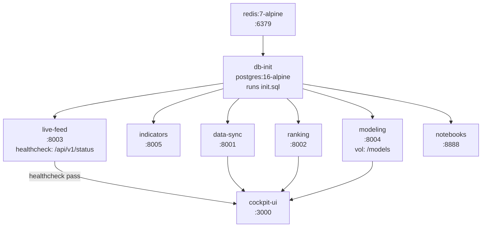
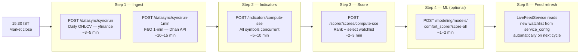
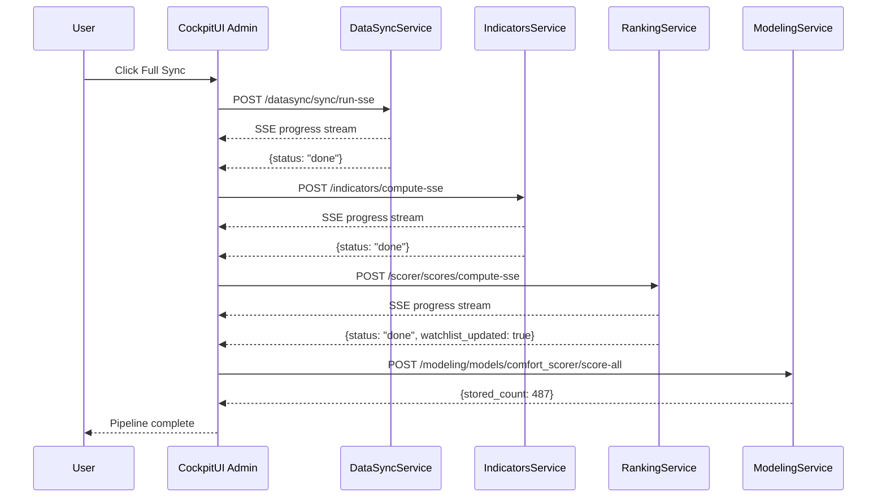
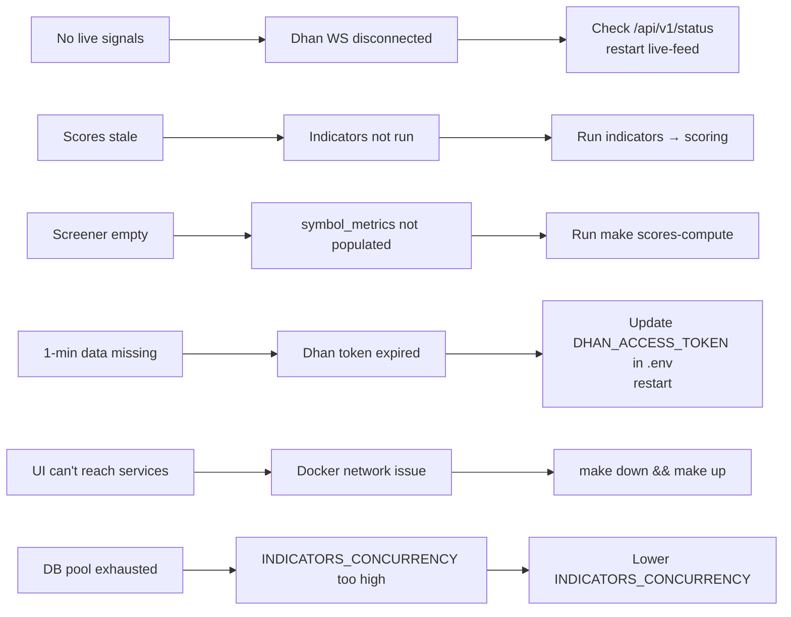
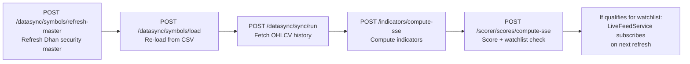
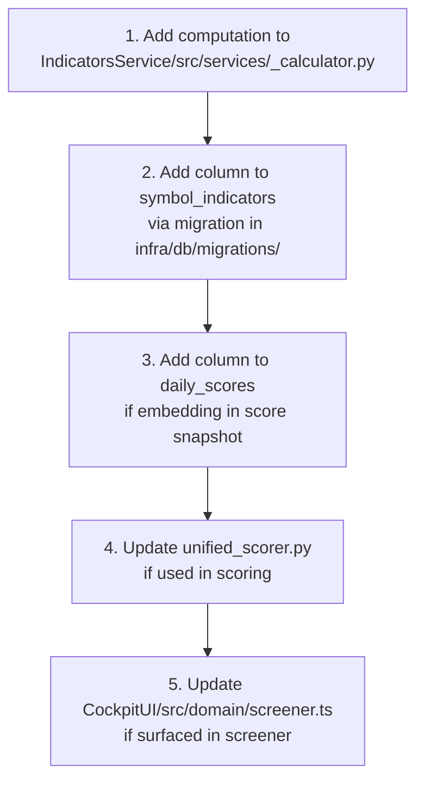

# Orchestration & Operations

## Docker Compose Service Graph



### Service Definitions Summary

```yaml
redis:
  image: redis:7-alpine
  volumes: [d:/docker-data/redis:/data]
  ports: [6379:6379]

db-init:
  image: postgres:16-alpine
  # Runs infra/db/setup.sh — creates DB + runs init.sql

data-sync:
  build: DataSyncService/
  ports: [8001:8000]
  env: [DATABASE_URL, REDIS_URL, DHAN_CLIENT_ID, DHAN_ACCESS_TOKEN]

indicators:
  build: IndicatorsService/
  ports: [8005:8000]
  env: [DATABASE_URL, REDIS_URL, INDICATORS_CONCURRENCY]

ranking:
  build: RankingService/
  ports: [8002:8000]
  env: [DATABASE_URL, REDIS_URL]

live-feed:
  build: LiveFeedService/
  ports: [8003:8000]
  env: [DATABASE_URL, REDIS_URL, DHAN_CLIENT_ID, DHAN_ACCESS_TOKEN]
  healthcheck: GET /api/v1/status

modeling:
  build: ModelingService/
  ports: [8004:8000]
  volumes: [./ModelingService/models:/models]
  env: [DATABASE_URL, REDIS_URL, MODEL_BASE_PATH, AUTO_RETRAIN_ENABLED]

cockpit-ui:
  build: CockpitUI/
  ports: [3000:3000]
  args:
    LIVE_FEED_URL: http://live-feed:8000
    NEXT_PUBLIC_LIVE_FEED_URL: http://localhost:8003

notebooks:
  build: notebooks/
  ports: [8888:8888]
  env: [DATABASE_URL]
```

---

## Daily Post-Market Pipeline



---

## Makefile Commands

```bash
make up                  # docker compose up --build (all services)
make down                # docker compose down

make sync                # POST /datasync/sync/run  (daily OHLCV)
make sync-1min           # POST /datasync/sync/run-1min  (F&O 1-min)
make scores-compute      # POST /indicators/compute + /scorer/scores/compute
make scores-dashboard    # GET  /scorer/dashboard  (print top ranked)
make comfort-score       # POST /modeling/models/comfort_scorer/score-all

make test-python         # pytest across all services
make coverage-python     # combined coverage report
make ui                  # open http://localhost:3000 (Windows)
```

---

## Full Pipeline via Admin UI



---

## Service Config Tuning (Runtime)

All services expose `/config` GET+POST. Config stored in `service_config` DB table.  
Changes apply without restart via `config_store.apply_overrides()` on each request cycle.

### LiveFeedService Tunable Config

```json
{
  "consolidation_lookback": 15,
  "consolidation_threshold_pct": 4.0,
  "volume_confirm_ratio": 1.2,
  "signal_cooldown_seconds": 300,
  "index_confluence_required": true,
  "candle_buffer_size": 100,
  "candle_flush_interval": 5
}
```

### RankingService Tunable Config

```json
{
  "watchlist_size_fno": 25,
  "watchlist_size_equity": 25,
  "score_date_lookback": 0,
  "balanced_response": true
}
```

### IndicatorsService Tunable Config

```json
{
  "concurrency": 10,
  "atr_period": 14,
  "rsi_period": 14,
  "squeeze_threshold": 0.02,
  "vcp_max_contraction_ratio": 0.80,
  "rect_max_range_pct": 10.0,
  "rect_min_bars": 20,
  "rect_max_bars": 40
}
```

---

## Monitoring & Health Checks

| Service | Health URL |
|---|---|
| DataSyncService | `GET http://localhost:8001/api/v1/health` |
| IndicatorsService | `GET http://localhost:8005/health` |
| RankingService | `GET http://localhost:8002/health` |
| LiveFeedService | `GET http://localhost:8003/api/v1/status` |
| ModelingService | `GET http://localhost:8004/health` |

LiveFeedService `/api/v1/status` returns richer state:
```json
{
  "status": "running",
  "dhan_ws_connected": true,
  "subscribed_symbols": 87,
  "signals_today": 142,
  "last_tick_at": "2026-04-26T09:47:33Z"
}
```

### Redis Key Inspection

```bash
redis-cli LLEN signals:history
redis-cli LRANGE signals:history 0 9
redis-cli LLEN "signals:daily:2026-04-26"
redis-cli GET dhan:access_token
```

---

## Common Failure Modes



---

## Adding a New Symbol



---

## Adding a New Indicator



---

## Security Notes

- `.env` contains Dhan tokens + DB passwords — **never commit**
- No auth on internal service APIs — trusted `trader-bridge` Docker network only
- Zerodha OAuth tokens stored per-account in DB — encrypted at rest (DB-level)
- `DHAN_ACCESS_TOKEN` seeded into Redis by LiveFeedService on startup (from env)
- No CI/CD pipeline — all deploys are manual `make up`
