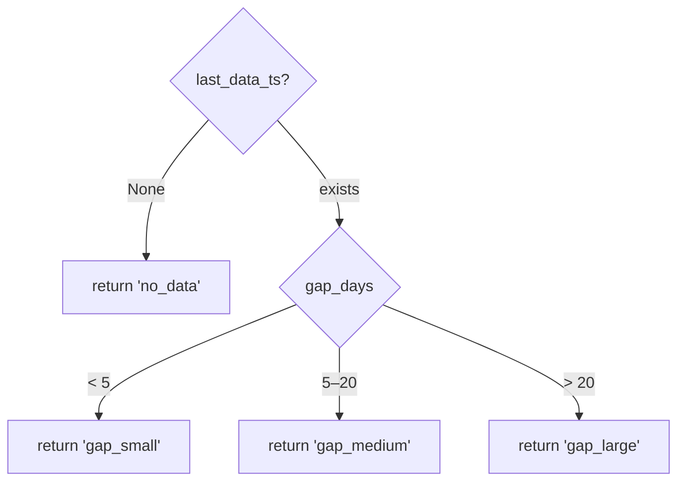
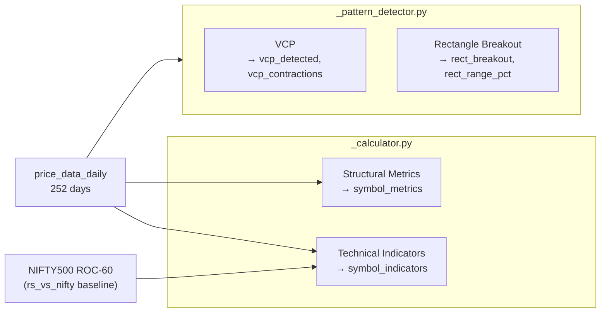
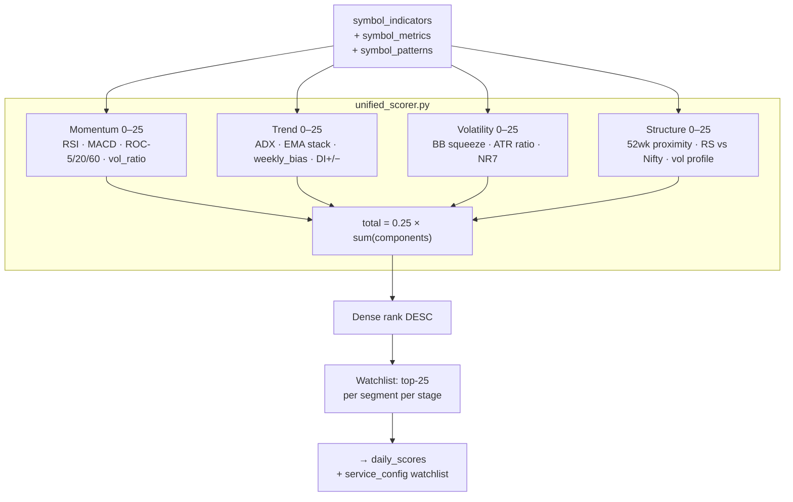
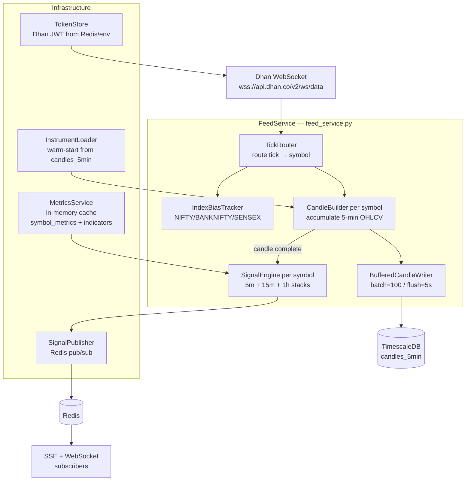
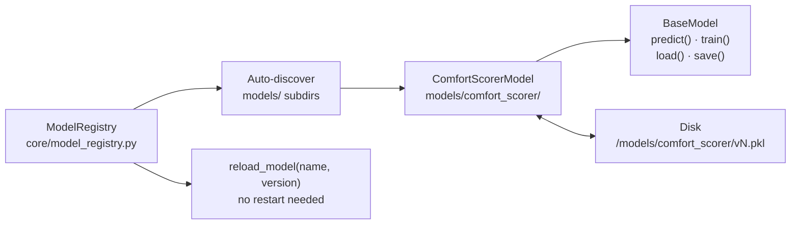
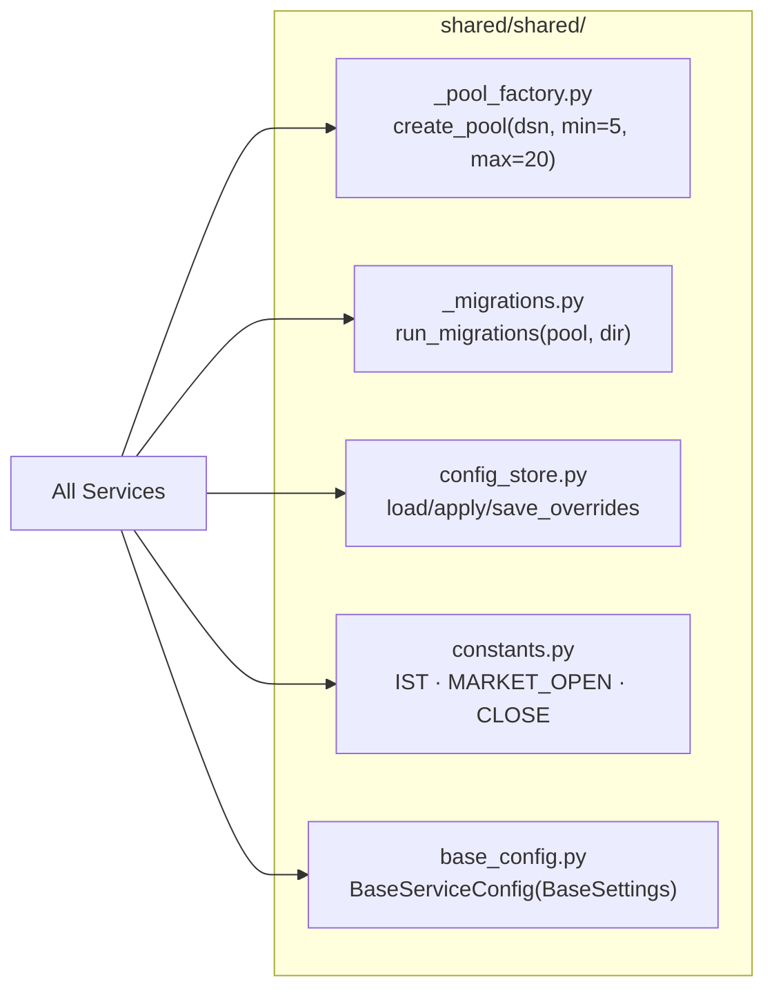

# Service Reference

## DataSyncService (Port 8001)

**Location:** `DataSyncService/src/`  
**Entry:** `main.py` | **Routes:** `api/routes.py`

### Endpoints

| Method | Path | Description |
|---|---|---|
| GET | `/api/v1/health` | Liveness check |
| POST | `/api/v1/symbols/load` | Load symbols from CSV → DB |
| POST | `/api/v1/symbols/refresh-master` | Re-download Dhan security master CSV |
| GET | `/api/v1/symbols/dhan-status` | Dhan security ID mapping coverage |
| GET | `/api/v1/symbols?series=EQ` | List symbols by series |
| POST | `/api/v1/sync/run` | Daily sync (background task) |
| POST | `/api/v1/sync/run-sse` | Daily sync with SSE progress |
| POST | `/api/v1/sync/run-1min` | 1-min Dhan sync for F&O (background) |
| POST | `/api/v1/sync/run-1min-sse` | 1-min sync with SSE progress |
| POST | `/api/v1/sync/run-all` | Parallel daily + 1-min sync (background) |
| POST | `/api/v1/sync/run-zerodha-sse` | Zerodha orders/trades/positions sync |
| GET | `/api/v1/sync/status` | Overall sync status per timeframe |
| GET | `/api/v1/sync/status/{symbol}` | Per-symbol sync status |
| POST | `/api/v1/sync/reset-1min` | Wipe price_data_1min + reset sync_state |
| GET | `/api/v1/sync/gaps` | Per-symbol gap classification report |
| GET | `/api/v1/prices/{symbol}/daily` | Query daily OHLCV (limit, from_ts, to_ts) |
| GET | `/api/v1/data-quality/1min` | Staleness check on price_data_1min |
| GET | `/api/v1/zerodha/accounts` | List Zerodha accounts |
| POST | `/api/v1/zerodha/accounts` | Save Zerodha account |
| DELETE | `/api/v1/zerodha/accounts/{account_id}` | Delete Zerodha account |
| GET | `/api/v1/zerodha/login/{account_id}` | Initiate Zerodha OAuth login |
| GET | `/api/v1/zerodha/callback` | OAuth callback handler |
| POST | `/api/v1/zerodha/sync` | Sync all Zerodha accounts |
| GET | `/api/v1/zerodha/performance` | Performance summary (`?start=&end=`) |
| GET | `/api/v1/zerodha/dashboard` | Dashboard view (`?start=&end=`) |
| GET | `/api/v1/zerodha/trades` | Reconstructed trades (`?start=&end=&account_id=`) |

### Key Services

**`services/sync_service.py`** — Daily yfinance sync  
**`services/minute_sync_service.py`** — 1-min Dhan API sync  
**`services/zerodha_sync_service.py`** — Zerodha broker integration  

### Gap Classification Logic



---

## IndicatorsService (Port 8005)

**Location:** `IndicatorsService/src/`  
**Entry:** `main.py` | **Routes:** `api/routes.py`

### Endpoints

| Method | Path | Description |
|---|---|---|
| POST | `/api/v1/compute` | Compute all indicators + patterns (background) |
| POST | `/api/v1/compute-sse` | Compute with SSE progress stream |
| POST | `/api/v1/compute-intraday-profile` | Compute ISS for all symbols from 90d 1-min data |
| POST | `/api/v1/compute-intraday-profile-sse` | ISS computation with SSE progress |
| GET | `/api/v1/intraday-profile/{symbol}` | Fetch cached ISS profile for symbol |

### Computation Modules

**`services/indicators_service.py`** — Orchestrator (concurrent per-symbol)  
**`services/_calculator.py`** — Structural metrics + technical indicators  
**`services/_pattern_detector.py`** — VCP + Rectangle Breakout detection  
**`services/intraday_profile_service.py`** — ISS computation from `price_data_1min`  

### Computation Flow



### Structural Metrics (`symbol_metrics`)

| Field | Computation |
|---|---|
| `week52_high / week52_low` | Rolling max/min over 252 trading days |
| `atr_14` | Average True Range, 14-day Wilder's smoothing |
| `adv_20_cr` | Avg Daily Value (close × volume), 20-day rolling, in crore |
| `ema_20 / ema_50 / ema_200` | Exponential moving averages |
| `prev_day_high/low/close` | Previous session OHLC |
| `prev_week_high/low` | High/low of prior 5 trading days |
| `prev_month_high/low` | High/low of prior 22 trading days |
| `week_return_pct` | 5-day return % |
| `cam_median_range_pct` | Median of `(H−L) × 1.1 / close` over 60 days |

### Technical Indicators (`symbol_indicators`)

| Field | Computation |
|---|---|
| `rsi_14` | Wilder RSI, 14-day |
| `macd_hist` | MACD (12,26,9) histogram |
| `macd_hist_std` | 20-day std dev of histogram (acceleration measure) |
| `roc_5 / roc_20 / roc_60` | Rate of Change over 5, 20, 60 bars |
| `vol_ratio_20` | Current volume / 20-day avg volume |
| `adx_14 / plus_di / minus_di` | ADX + directional indicators |
| `weekly_bias` | BULLISH if close > EMA-50, BEARISH if below, NEUTRAL otherwise |
| `bb_squeeze / squeeze_days` | BB width < threshold + consecutive squeeze day count |
| `nr7` | True if today's range < all prior 6 days' ranges |
| `atr_ratio` | Current ATR / 20-day avg ATR (contraction signal when < 0.7) |
| `atr_5` | Short-term 5-day ATR |
| `bb_width / kc_width` | Bollinger Band / Keltner Channel % width |
| `rs_vs_nifty` | `symbol_roc60 − nifty500_roc60` (relative strength) |
| `stage` | STAGE_1 / STAGE_2 / STAGE_3 / STAGE_4 / UNKNOWN |

### Pattern Detection

**VCP (Volatility Contraction Pattern)**
- Precondition: `close > ema_50`
- Find 2–3 swing high-to-low contractions
- Each contraction must be ≤ 80% of the prior contraction's range
- Volume must decline through contractions
- Output: `vcp_detected: bool`, `vcp_contractions: int`

**Rectangle Breakout**
- Find 20–40 bar consolidation window where `(max_high − min_low) / min_low ≤ 10%`
- Last bar must close above `range_high` with `vol_ratio > 1.5`
- Output: `rect_breakout: bool`, `rect_range_pct: float`, `consolidation_days: int`

---

## RankingService (Port 8002)

**Location:** `RankingService/src/`  
**Entry:** `main.py` | **Routes:** `api/routes.py`

### Endpoints

| Method | Path | Description |
|---|---|---|
| POST | `/api/v1/scores/compute` | Trigger unified scoring (background) |
| POST | `/api/v1/scores/compute-sse` | Scoring with SSE progress |
| GET | `/api/v1/dashboard` | Stats + scored symbols with filters |
| GET | `/api/v1/dashboard/watchlist` | Current watchlist for live subscription |
| GET | `/api/v1/watchlist/stage` | Stage 2/4 watchlist (`?side=bull\|bear\|both`) |
| GET | `/api/v1/config` | Service configuration (tunable) |

**Dashboard query params:**
```
score_date=YYYY-MM-DD   default: latest
limit=50 / offset=0
watchlist_only=false
segment=fno|equity
balanced=true           equal fno/equity split in response
```

### Unified Scoring Algorithm

**File:** `src/signals/unified_scorer.py`

```python
total_score = (
    0.25 * momentum_score    +   # RSI + MACD + ROC + volume
    0.25 * trend_score       +   # ADX + EMA stack + weekly_bias + DI
    0.25 * volatility_score  +   # BB squeeze + ATR contraction + NR7
    0.25 * structure_score       # 52wk proximity + RS vs Nifty + volume profile
)
```



**Momentum Score (0–25)**  
Inputs: `rsi_14`, `macd_hist`, `macd_hist_std`, `roc_5/20/60`, `vol_ratio_20`
- RSI in [40–70] range = positive
- MACD histogram positive + accelerating = bonus
- ROC-5, ROC-20, ROC-60 all positive = full alignment bonus
- Volume > 20-day avg = volume confirmation

**Trend Score (0–25)**  
Inputs: `adx_14`, `plus_di`, `minus_di`, `ema_20/50/200` (from symbol_metrics), `weekly_bias`
- ADX > 25 = strong trend confirmation
- EMA stack: close > EMA-20 > EMA-50 > EMA-200 = maximum points
- DI+ > DI- = bullish direction
- `weekly_bias = BULLISH` = additional points

**Volatility Score (0–25)**  
Inputs: `bb_squeeze`, `squeeze_days`, `atr_ratio`, `nr7`
- BB squeeze active = contraction in progress (pre-breakout setup)
- Longer squeeze = higher score
- ATR ratio < 0.7 = contraction
- NR7 = narrowest range in 7 days = compression

**Structure Score (0–25)**  
Inputs: `week52_high/low` (from symbol_metrics), `rs_vs_nifty`, volume profile
- Price within 5% of 52-week high = full score
- RS vs Nifty > 0 = outperforming market
- Sustained high relative volume = strong participation

### Watchlist Selection

```python
# After scoring all symbols:
bull_candidates = [s for s in scored if s.stage == 'STAGE_2']
bear_candidates = [s for s in scored if s.stage == 'STAGE_4']

# Top 25 per segment per stage:
watchlist = (
    top_n(bull_candidates, segment='fno',    n=25) +
    top_n(bull_candidates, segment='equity', n=25) +
    top_n(bear_candidates, segment='fno',    n=25) +
    top_n(bear_candidates, segment='equity', n=25)
)
# Mark is_watchlist=true in daily_scores, publish to service_config
```

---

## LiveFeedService (Port 8003)

**Location:** `LiveFeedService/src/`  
**Entry:** `main.py` | **Lifespan:** `_lifespan.py`

### Endpoints

| Method | Path | Description |
|---|---|---|
| GET | `/api/v1/status` | Service health + connection state |
| GET | `/api/v1/signals/stream` | SSE stream of trading signals |
| WS | `/api/v1/signals/ws` | WebSocket signal stream |
| GET | `/api/v1/signals/history` | Historical signals (`?date=YYYY-MM-DD&offset=&limit=`) |
| GET | `/api/v1/signals/history/dates` | IST dates with saved history |
| GET | `/api/v1/instruments/metrics` | All instruments with indicator snapshot |
| GET | `/api/v1/screener` | Screener data (all symbols with metrics/indicators/patterns) |
| GET | `/api/v1/prices/stream` | Live price SSE stream (no history) |
| GET | `/api/v1/token/status` | Dhan token status + expiry |
| GET | `/api/v1/optionchain/expiries` | Available option expiries |
| GET | `/api/v1/optionchain` | Option chain (`?symbol=&expiry=YYYY-MM-DD`) |
| GET | `/api/v1/config` | Tunable service config |

### Internal Component Architecture



### Signal Types

| Signal | Direction | Trigger |
|---|---|---|
| `RANGE_BREAKOUT` | BULLISH | Price exits intraday consolidation range upward |
| `RANGE_BREAKDOWN` | BEARISH | Price exits intraday consolidation range downward |
| `CAM_H4_BREAKOUT` | BULLISH | Close above Camarilla H4 pivot level |
| `CAM_H4_REVERSAL` | BEARISH | Pin bar / rejection at H4 |
| `CAM_H3_REVERSAL` | BEARISH | Rejection at H3 |
| `CAM_L4_BREAKDOWN` | BEARISH | Close below Camarilla L4 pivot level |
| `CAM_L4_REVERSAL` | BULLISH | Pin bar / rejection at L4 |
| `CAM_L3_REVERSAL` | BULLISH | Rejection at L3 |

**Camarilla Pivot Formulas** (using previous day H/L/C):
```
H4 = C + 1.1/12 × (H − L)
H3 = C + 1.1/6  × (H − L)
L3 = C − 1.1/6  × (H − L)
L4 = C − 1.1/12 × (H − L)
```

### Redis Signal Storage

```
PUBLISH signals <signal_json>             ← real-time broadcast
PUBLISH signals:{symbol} <signal_json>    ← per-symbol broadcast
LPUSH   signals:history <signal_json>     ← global rolling history
LTRIM   signals:history 0 199             ← max 200 entries
LPUSH   signals:daily:{YYYY-MM-DD} <json> ← daily list
EXPIRE  signals:daily:{YYYY-MM-DD} 86400  ← TTL: 24 hours
```

---

## ModelingService (Port 8004)

**Location:** `ModelingService/src/`  
**Entry:** `main.py` | **Routes:** `api/routes.py`

### Endpoints

| Method | Path | Description |
|---|---|---|
| POST | `/api/v1/models/{model_name}/predict` | Single inference for given symbols + date |
| POST | `/api/v1/models/{model_name}/score-all` | Batch inference for all scored symbols |
| POST | `/api/v1/models/{model_name}/retrain` | Trigger model retraining (stub) |
| GET | `/api/v1/models/status` | Model registry status |
| GET | `/api/v1/config` | Service configuration |
| POST | `/api/v1/models/session_classifier/build-training-data` | Build labeled sessions from 5yr daily (one-time / weekly) |
| POST | `/api/v1/models/session_classifier/train` | Train LightGBM classifier + pullback regressor |
| POST | `/api/v1/models/session_classifier/evaluate` | Evaluate model accuracy on held-out test set |
| POST | `/api/v1/models/session_classifier/score-all` | Predict session types for all watchlist symbols |
| POST | `/api/v1/models/session_classifier/pipeline-sse` | Full pipeline SSE: build → train → score |
| GET | `/api/v1/models/session_classifier/predict/{symbol}` | Single-symbol session prediction |

### Model Registry Architecture



**Predict request:**
```json
{
  "symbols": ["RELIANCE", "TCS"],
  "date": "2026-04-25"
}
```

**Predict response:**
```json
{
  "model": "comfort_scorer",
  "version": "v1",
  "predictions": [
    {
      "symbol": "RELIANCE",
      "prediction_date": "2026-04-25",
      "confidence": 0.82,
      "predictions": { "comfort_score": 74.3, "interpretation": "comfortable" }
    }
  ],
  "stored_count": 2
}
```

### Model Registry

| Model | Type | Artifact | Purpose |
|---|---|---|---|
| `comfort_scorer` | Rule-based | n/a (no pkl) | Chart readability score v2 (0-100) |
| `session_classifier` | LightGBM multiclass | `lgbm_session_classifier.pkl` | Predict session type: TREND_UP/DOWN/CHOP/VOLATILE/GAP_FADE/NEUTRAL |
| `pullback_regressor` | LightGBM regression | `lgbm_pullback_regressor.pkl` | Predict pullback depth on up days (0-1) |

**ComfortScore v3** = f(comfort_v2, ISS penalty, pullback prediction, session modifier). Computed in-line after session_classifier runs. Stored in `model_predictions.predictions.comfort_score_v3`.

**Session classifier features (18):** `prev_rsi`, `prev_adx`, `prev_di_spread`, `prev_atr_ratio`, `prev_roc_5`, `prev_roc_20`, `prev_vol_ratio`, `prev_bb_squeeze`, `prev_squeeze_days`, `prev_rs_vs_nifty`, `stage_encoded`, `day_of_week`, `nifty_gap_pct`, `iss_score`, `choppiness_idx`, `stop_hunt_rate`, `orb_followthrough_rate`, `pullback_depth_hist`

**Training data:** 5yr × ~500 symbols = ~625,000 labeled sessions. GroupShuffleSplit by date (80/20). Models saved to `MODEL_BASE_PATH/session_classifier/`.

### Auto-Retrain Config

```
AUTO_RETRAIN_ENABLED=true
MAX_MODEL_AGE_DAYS=90
COMFORT_SCORER_RETRAIN_THRESHOLD_RMSE=8.0
COMFORT_SCORER_SHADOW_DAYS=7  (new model runs in shadow before promotion)
```

---

## Shared Library

**Location:** `shared/shared/`  
**Installed:** editable in all services via `pyproject.toml`

### Module Map



**`_pool_factory.py`**
```python
create_pool(dsn, min_size=5, max_size=20, command_timeout=60) → asyncpg.Pool
# Server settings applied: tcp_keepalives, lock_timeout, idle_in_transaction_session_timeout
```

**`_migrations.py`**
```python
run_migrations(pool, migrations_dir, timeout=None)
# Applies .sql files from directory in order
# Handles TimescaleDB worker cancellation
# Statement timeout: 24h if not specified
```

**`config_store.py`**
```python
load_overrides(pool, service: str) → dict
apply_overrides(settings: BaseSettings, overrides: dict)
save_overrides(pool, service: str, updates: dict)

# Excluded from tuning (never overridden):
# database_url, redis_url, log_level, dhan credentials, model_base_path
```

**`constants.py`**
```python
IST = ZoneInfo("Asia/Kolkata")
MARKET_OPEN  = time(9, 15)
MARKET_CLOSE = time(15, 30)
DEFAULT_ACQUIRE_TIMEOUT = 30  # seconds
```
