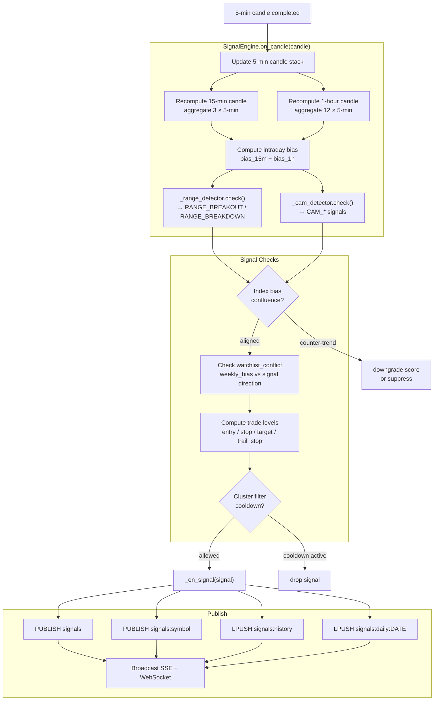
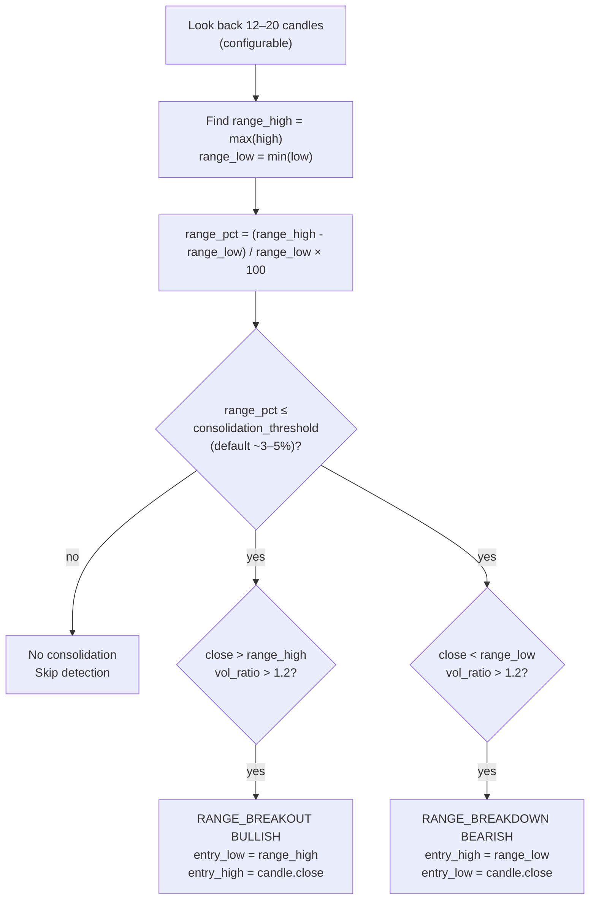
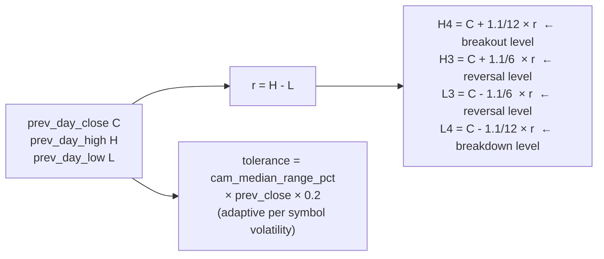
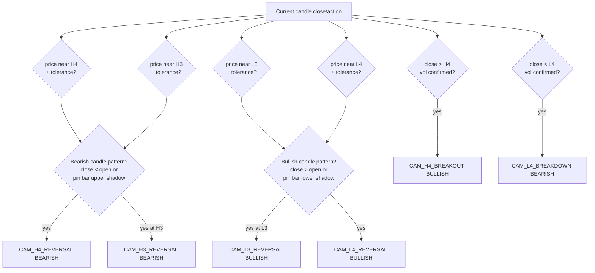
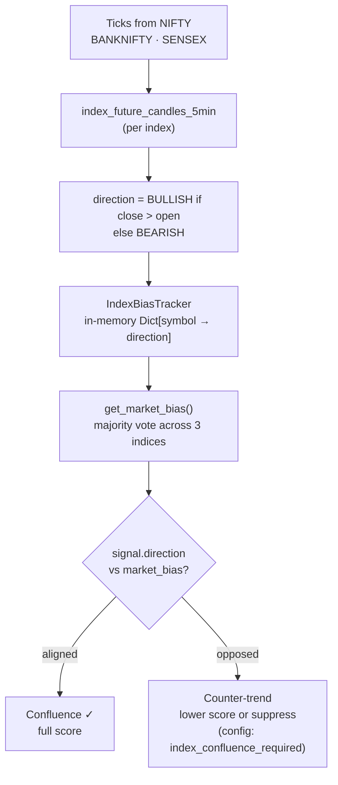
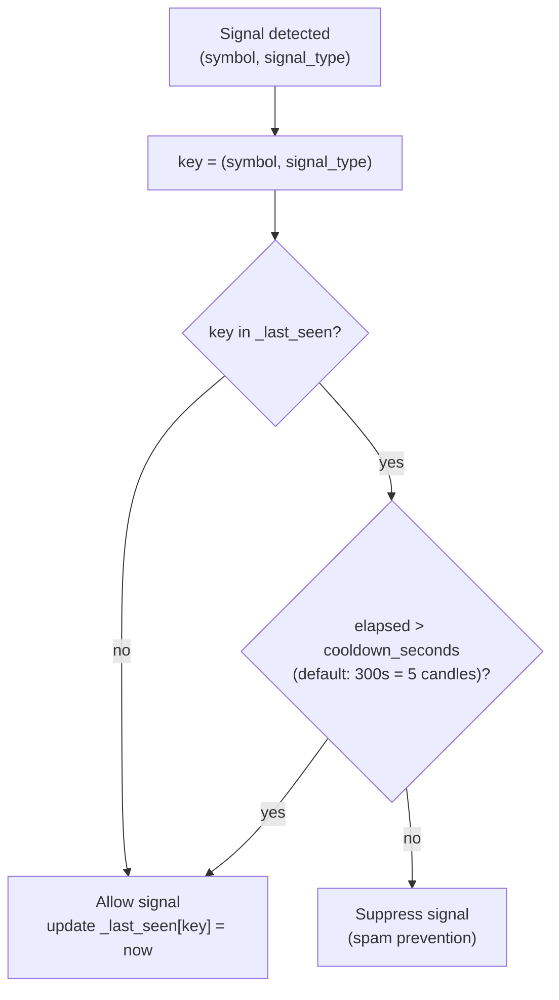
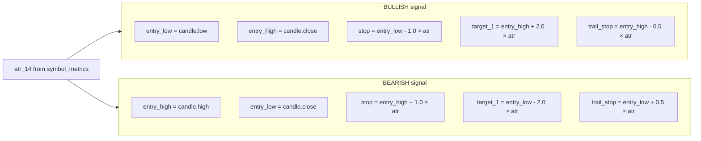
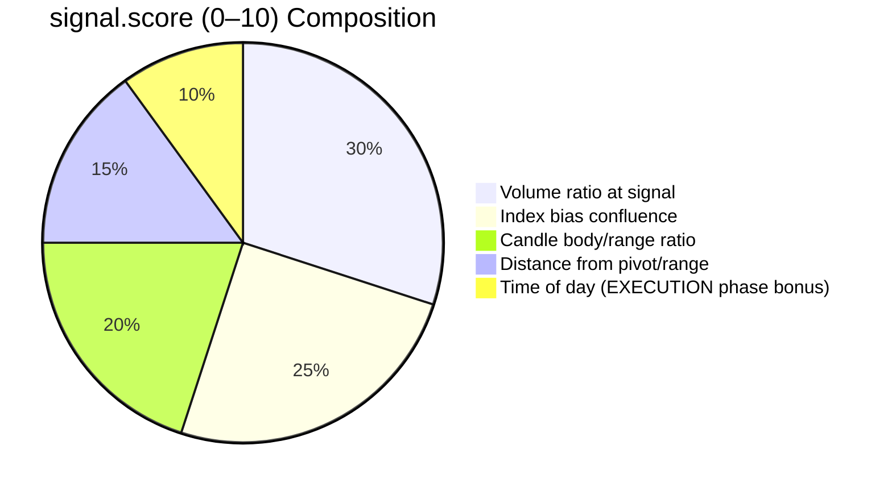
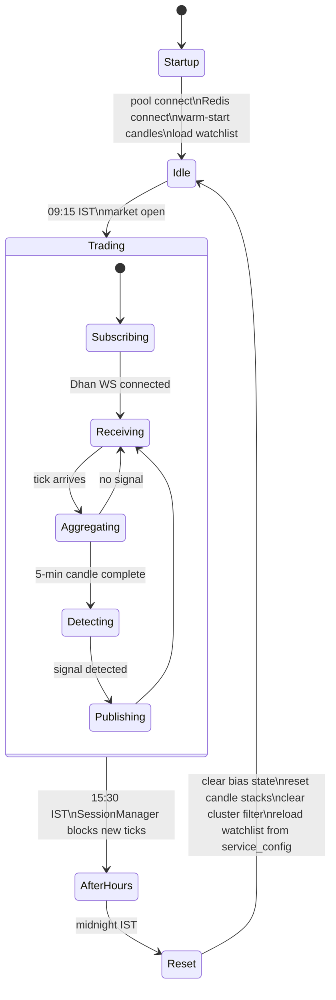
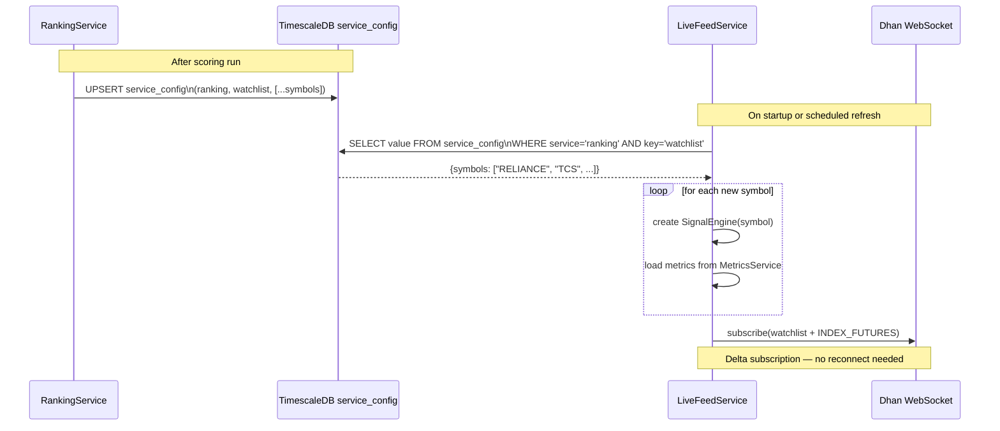

# Signal Engine — LiveFeedService Deep Dive

## Overview

Each watchlist symbol gets a dedicated `SignalEngine` instance. Engine receives completed 5-min candles and decides whether a tradeable signal has occurred.

---

## Signal Detection Flow



---

## Range Breakout Detection



---

## Camarilla Signal Detection

### Pivot Level Calculation



### Signal Conditions



---

## Index Bias Integration



---

## Cluster Filter (Deduplication)



---

## Trade Level Computation



---

## Signal Score Factors



---

## Session Lifecycle



---

## Watchlist Subscription Lifecycle



---

## Redis Signal Payload

Full JSON structure of a published signal:

```json
{
  "id": "3f8a1bc2-...",
  "symbol": "RELIANCE",
  "signal_type": "RANGE_BREAKOUT",
  "direction": "BULLISH",
  "price": 1423.50,
  "volume_ratio": 2.34,
  "score": 7.8,
  "timestamp": "2026-04-26T06:45:00Z",
  "message": "Range breakout above 1418.00 with 2.3× volume",
  "bias_15m": "BULLISH",
  "bias_1h": "BULLISH",
  "entry_low": 1418.00,
  "entry_high": 1423.50,
  "stop": 1402.30,
  "target_1": 1455.70,
  "trail_stop": 1415.25,
  "watchlist_conflict": false
}
```
